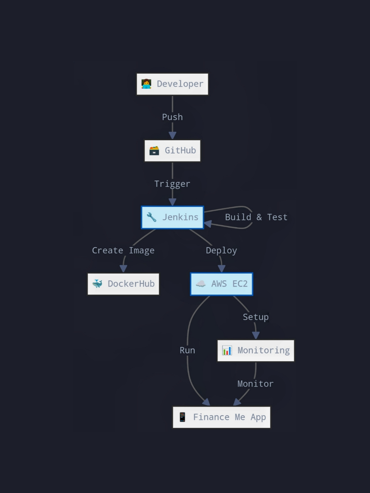

# FinanceMe Microservice with DevOps CI/CD Pipeline

<p align="center">
  
</p>


## Project Overview
FinanceMe is a financial services provider. The core application code was developed by someone else, and I made some modifications, focusing on DevOps pipeline automation.

## Key Technologies
- Spring Boot
- Maven
- Docker
- Jenkins
- Ansible
- Terraform
- Prometheus
- Grafana

## API Endpoints
- **POST** `/createAccount` – Create a new account.
- **PUT** `/updateAccount/{accountNo}` – Update account details.
- **GET** `/viewPolicy/{accountNo}` – View account details.
- **DELETE** `/deletePolicy/{accountNo}` – Delete an account.

## My Contributions
- Improved the CI/CD pipeline.
- Configured infrastructure automation using Terraform.
- Set up Docker for containerization.
- Configured Prometheus and Grafana for monitoring.

## Setup Instructions

### Prerequisites
- AWS Account
- Docker & Docker Hub Account
- Jenkins installed on an AWS EC2 instance
- Maven and JDK installed

### Clone Repository
```sh
git clone git clone https://github.com/suguslove10/finance-me-microservice.git
cd finance-me-microservice 
```

### Build and Run
```sh
mvn clean package
docker build -t finance-me-microservice:v1 .
docker run -p 8081:8080 finance-me-microservice:v1
```
## Jenkins Pipeline Stages
- Clone Git Repository: Fetches the project code from GitHub.
- Build Maven Project: Executes mvn clean package to compile and package the Java project.
- Build Docker Image: Builds a Docker image for the microservice.
- Push Docker Image: Pushes the image to Docker Hub.
- Terraform Setup: Initializes and applies Terraform to provision AWS infrastructure.
- Ansible Playbook Execution: Configures the microservice on the EC2 instance.
- Monitoring Setup: Configures Prometheus and Grafana for system monitoring.

## Monitoring and Metrics
Prometheus and Grafana are used for continuous monitoring of the microservices and infrastructure.

- Node Exporter: Monitors server metrics such as CPU, memory, and disk usage.
- Prometheus: Scrapes metrics from the Node Exporter.
- Grafana: Visualizes metrics through dashboards.

### License
License Distributed under the MIT License. See [MIT License](https://opensource.org/licenses/MIT) for more information.


